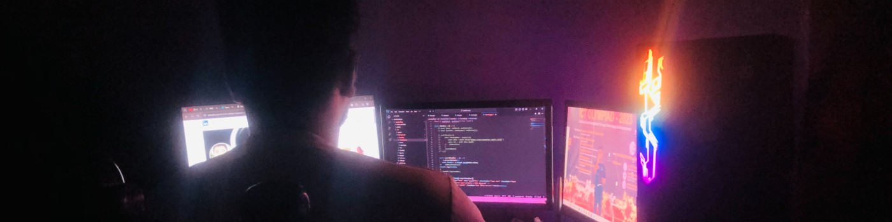
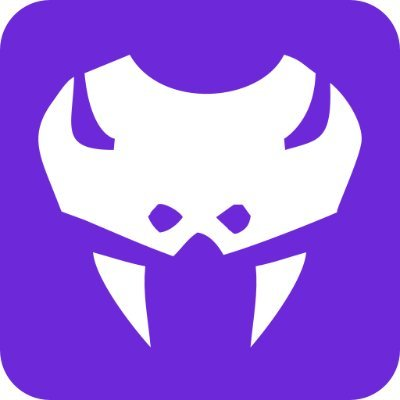

##
# Welcome to My GitHub Repository

## Introduction
Hello! I am Md Saddam Hossain Saykat. This repository serves as a platform for me to showcase my projects and contributions in various fields.

## :chart_with_upwards_trend: Current Stats

  

 
<h2 align="left"> ⚙ Technologies</h2>
<table align="center">
  <tr>
    <td align="center" width="96">
      
       HTML
    </td>
    <td align="center" width="96">
      
       CSS
    </td>
    <td align="center" width="96">
      
       Java Script
    </td>
    <td align="center" width="96">
      
       TailWind CSS
    </td>
    <td align="center" width="96">
      
       DaisyUi
    </td>
    <td align="center" width="96">
      
       MambaUi
    </td>
    <td align="center" width="96">
      
       BootStrap
    </td>
    <td align="center" width="96">
      
       Firebase
    </td>
    <td align="center" width="96">
      
       Vercel
    </td>
    <td align="center" width="96">
      
       DaisyUi
    </td>
    <td align="center" width="96">
      
       React Js
    </td>
    <td align="center" width="96">
      
       Node Js
    </td>
    <td align="center" width="96">
      
       Express Js
    </td>
    <td align="center" width="96">
      
       MongoDB
    </td>
    <td align="center" width="96">
      
       Python
    </td>
    <td align="center" width="96">
      
       Redux
    </td>
    <td align="center" width="96">
      
       TypeScript
    </td>
  </tr>
</table>

## Projects
- **Project 1**: [Pet Traction](https://pet-traction.web.app/) - This Web For Adopt Pet.
- **Project 2**: [Book World](https://jovial-banoffee-f958aa.netlify.app/) - This Web For All arount book.
- **Project 3**: [Bus Ticket](https://saddamsaykat.github.io/smart-ticket/) - This Project for Bus Tickets.

## Skills
- List your skills here, such as programming languages, tools, and technologies.

## Contact
- **Email**: mdsaddamhossainsaykat@gmail.com
- **LinkedIn**: [LinkedIn Profile](https://www.linkedin.com/in/md-saddam-hossain-saykat-3a66a7211/)
<!-- - **Website**: [Your Website](https://your-website.com) -->

## License
This project is licensed under the [Md. Saddam Hossain Saykat] - see the LICENSE.md file for details.

## Acknowledgments
- Any acknowledgments or credits, if applicable.

Feel free to explore the projects and connect with me!

